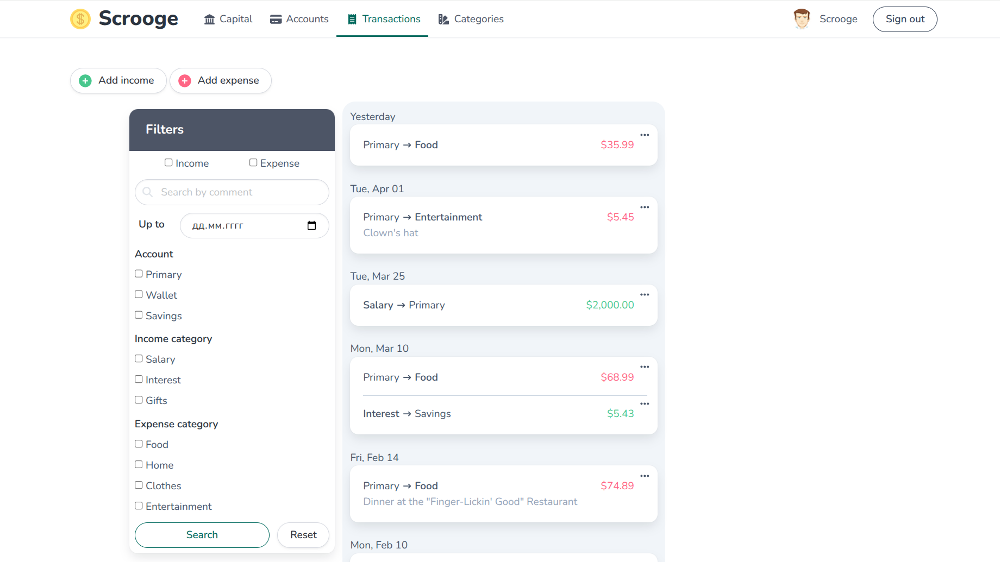

# Scrooge — your personal accountant.

[](https://github.com/standardrb/standard)
[](https://github.com/excellent404/scrooge/actions/workflows/ci.yml)
[](https://codecov.io/gh/ExceLLent404/scrooge)

Scrooge is an app that helps you manage your personal finances.
- Track all your accounts in different currencies.
- Record your income and expenses and group them into categories.
- Find the transactions you need easily using different filters.
- View your total capital amount with up-to-date currency exchange rates.
- Find out the total amount of your income and expenses for any period, as well as by category.

[👀 View the live demo](https://scrooge.onrender.com/) (_it may take a long time on first request_)



## 👨‍💻 How to run demo locally

> **Prerequisites:** You must have [Docker](https://docs.docker.com/engine/install/) and [Docker Compose](https://docs.docker.com/compose/install/) installed on your computer and approximately 2.7GB of free space.

1. Clone or download the project repository.
2. Open the project folder in the terminal.
3. Setup the application by running the following command:

```bash
docker compose run --rm web bash -c "bin/setup && yarn build && yarn build:css"
```

The first launch may take a long time (about 6 min) as it is necessary to build the application and download additional Docker images.

4. _Optional step._ Update the exchange rates if you want it to be up to date.

> You need to register on the [Open Exchange Rates](https://openexchangerates.org/signup/free) and get an `App ID`. It's free.

Create the appropriate environment variable:

```bash
cat .env.example > .env
```

and specify your `App ID` as the variable value. Then run:

```bash
docker compose run --rm web rails money:update_exchange_rates
```

5. Start the application:

```bash
docker compose run --rm --service-ports web rails server -b 0.0.0.0
```

The application will be available on [localhost:3000](http://localhost:3000/).

_Restrictions:_

1. The application will not send real emails. All sent emails are available on [/letter_opener](http://localhost:3000/letter_opener) page.
2. If you skipped the fourth step, the exchange rates will be static as defined in the [configuration](config/initializers/money.rb).

---

6. _Optional step._ Remove the application and clear the space it takes up:

> **Warning:** These commands may remove Docker-specific data you need. Use with caution.

```bash
docker compose down --remove-orphans --rmi all --volumes && \
docker builder prune && \
cd .. && rm -rf scrooge/
```
